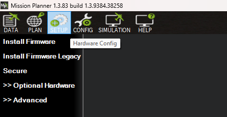
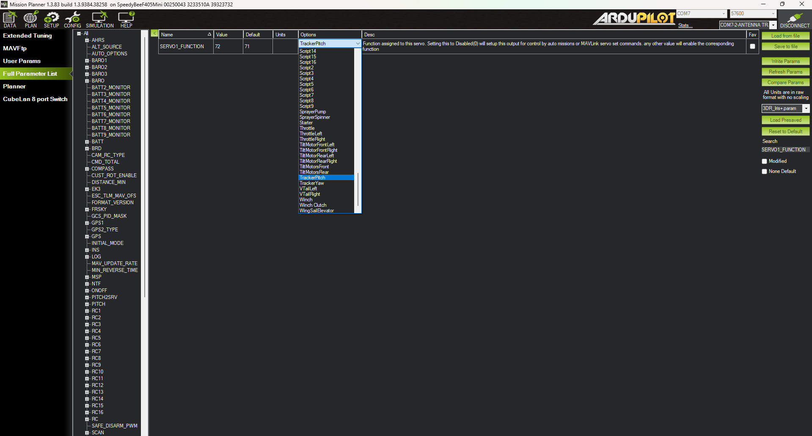
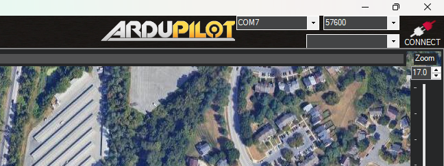
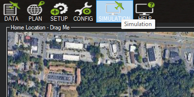
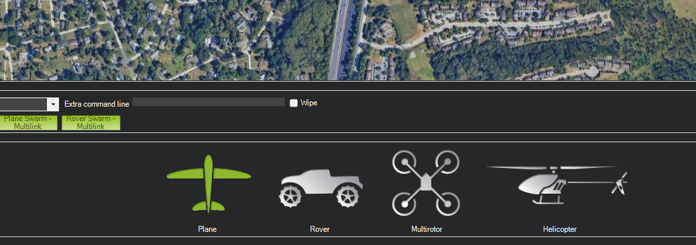
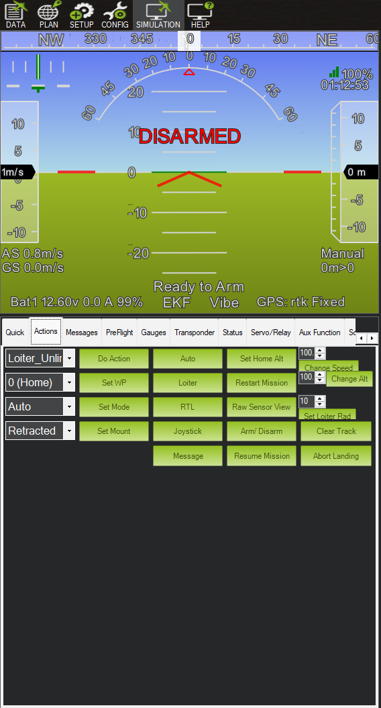
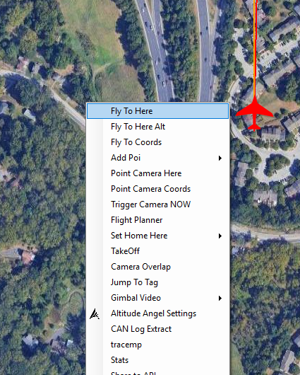
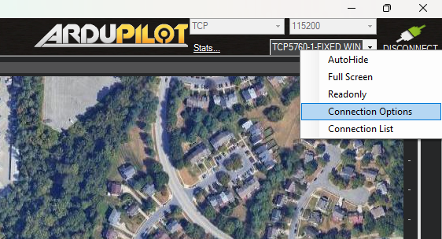
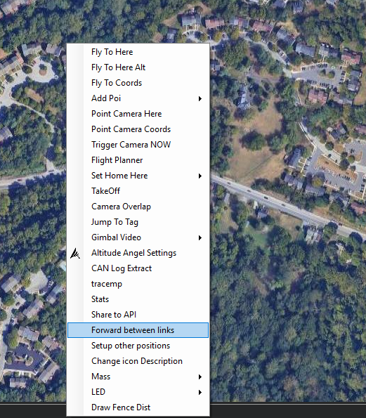
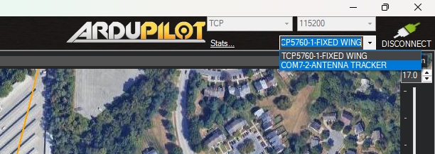

# Ardupilot Antenna Tracker Unofficial Documentation

The antenna tracker is an attempt to increase the range of a normal Sik telemetry radio using a bigger directional Yagi antenna and a setup to point it towards the UAV while it is flying.

The antenna tracker uses the Ardupilot Antenna Tracker firmware and the current closely follows the general setup outlined in the documentation.

---
## Required Hardware:

1. Ardupilot compatible flight controller ([Speedybee F405 mini](https://www.speedybee.com/speedybee-f405-mini-bls-35a-20x20-stack/))
2. Power distribution board ([PDB500 APD](https://docs.powerdrives.net/products/f_series/quick-start-guide)) (optional if the FC is not powerful enough to drive the servos)
3. 2 MG995 Servos (or any >=180 deg servos).
4. GPS (with a magnetometer if the FC does not come with one)
5. Pan and Tilt system ([3D print here](https://www.thingiverse.com/thing:3458238))
6. Sik Telemetry Radio ([Holybro](https://docs.px4.io/main/en/telemetry/holybro_sik_radio))
7. A Yagi Antenna that matches the Telemetry radio's frequency ([AliExpress Link](https://www.aliexpress.us/item/3256809928576038.html?src=google&pdp_npi=4%40dis!USD!13.14!13.14!!!!!%40!12000052677429084!ppc!!!&src=google&albch=shopping&acnt=708-803-3821&isdl=y&slnk=&plac=&mtctp=&albbt=Google_7_shopping&aff_platform=google&aff_short_key=UneMJZVf&gclsrc=aw.ds&albagn=888888&ds_e_adid=&ds_e_matchtype=&ds_e_device=c&ds_e_network=x&ds_e_product_group_id=&ds_e_product_id=en3256809928576038&ds_e_product_merchant_id=661153954&ds_e_product_country=US&ds_e_product_language=en&ds_e_product_channel=online&ds_e_product_store_id=&ds_url_v=2&albcp=19678427463&albag=&isSmbAutoCall=false&needSmbHouyi=false&gad_source=1&gad_campaignid=19686402437&gbraid=0AAAAAD6I-hHvzbZVfD1T8fDB8FsLnhX54&gclid=CjwKCAiAj8LLBhAkEiwAJjbY78DhKPwMYbgFTYVShnfIDAbkG6Wf3i8Aii-M-HvHo7GFelJMNBYSuhoCcTkQAvD_BwE&gatewayAdapt=glo2usa))
---
## Hardware setup:

1. Set up the pan and tilt system.
2. Set the flight controller and the GPS on the moving part of the Pan and Tilt system. Keep the GPS a sufficient distance away from the flight controller.
3. If your flight controller is not sufficient to power the servos and the GPS, use a power distribution board to supply power to the servos and connect the motor pins to the data wire on the servos (M1 M2 on the flight controller).
 
 ---
## Mission Planner Setup:

1. Connect your flight controller to your mission planner.
2. Go to the "Setup" page
3. 
4. Click "Install Firmware".
5. Click the "antenna tracker". This will flash the antenna tracker firmware to the flight controller.

---
## Setup and Parameters:

### Servo Testing:
1. To test the servo's movement, make sure the antenna tracker is powered.
2. Go to the The "Config" tab and click full parameter list and on the search bar, search for `SERVO1_FUNCTION` and set it to `tracker pitch` (open the options drop down and select it).
3. 
4. Similarly, change the `SERVO2_FUNCTION` to `Tracker yaw`.
5. If using 180 degree servos, you might need to change the `SERVOX_MAX` and `SERVOX_MIN` to different values (for MG995, min is 800 and max is 2200).
6. Now to move the servos, go to the "Extended Tuning" page on the "Config" tab.
7. Move the dials and click the "Test" button to move the servos.

---
## Simulator Instructions:

- These instruction might help some: [Source](https://discuss.ardupilot.org/t/antenna-tracker-step-by-step-setup-and-simulator/50368)
- These worked for me:
	1. Open up mission planner.
	2. Ensure the antenna tracker is identifiable (for me, it is COM 7)
	3. 
	4. Now, we are going to fly a simulated plane. Click on the "SIMULATION" tab.
	5. 
	6. Select "Plane" from the bottom tab.
	7. 
	8. Now, wait for Mission planner to start up SITL.
	9. Once SITL is fully launched, go to the "Actions" tab on the "Data" page.
	10. 
	11. On the drop down next to the "Set Mode" button, select "Takeoff" and the select Set Mode. This will give the simulated plane to take off and start loitering after getting above a certain altitude.
	12. Now on the map on the "Data" page, right click on a location nearby the home location (not too close) and select "Fly to here".
	13. 
	14. Now go back to the "Actions" tab and in the drop down (where you selected "Takeoff"), select "Auto" and then click on the "Set Mode" button.
	15. This will now cause your plane to circle the spot you just selected.
	16. Now we will forward the mavlink telemetry of this plane to the Antenna tracker.
	17. Right click on the "DISCONNECT" button and select "Connection Options".
	18. 
	19. This will open up a small dialogue box. On the top drop down, select the COM port on which you connected your Antenna Tracker (for me, COM7) and on the bottom, select the Baud rate (for me, 57600). Now press the "Connect".
	20. Mission Planner will now establish a connection with the Antenna Tracker on the selected COM port.
	21. Now, right click on the Map on the "Data" page and select "Forward between links."
	22. 
	23. You Antenna Tracker should now jump to life and start tracking the plane.
	24. To view your antenna tracker's Mission Planner screen, select the drop down next to the disconnect button and select the AT.
	25. 
	26. You should now see the Antenna Tracker's control panel now. Use the same drop down to switch between the simulated plane and the AT.
### If your Antenna Tracker does not jump to life:

1. Make sure your battery is connected.
2. Make sure the mode is set to "AUTO" in the actions tab. Don't forget to click on "Set Mode".

---
